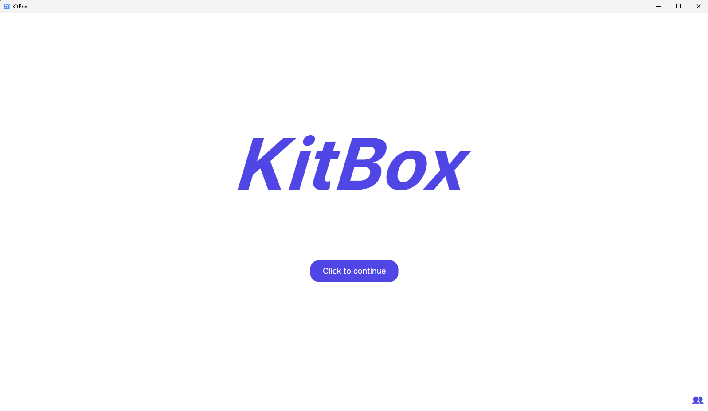
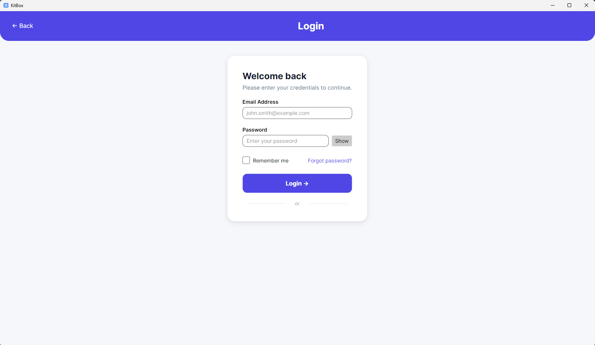
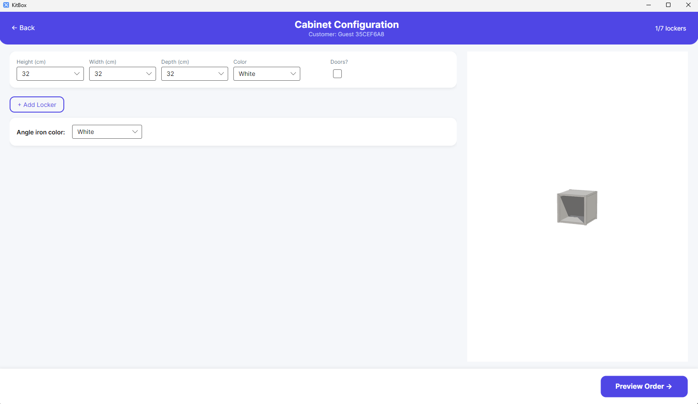
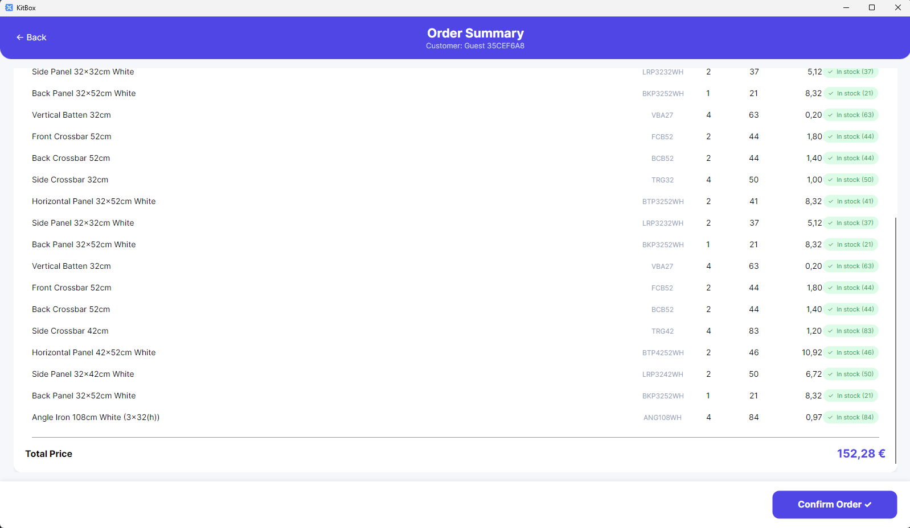
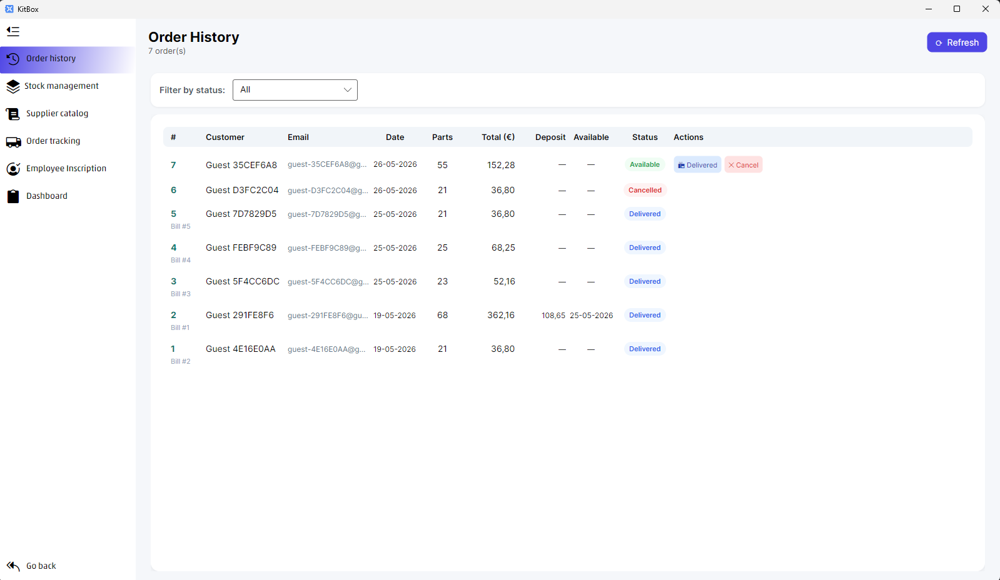
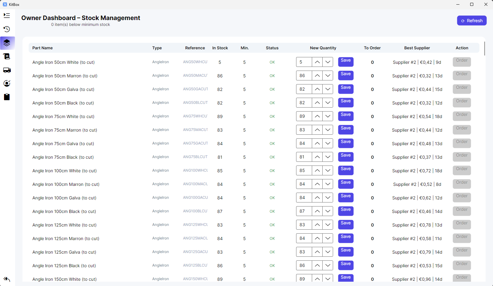
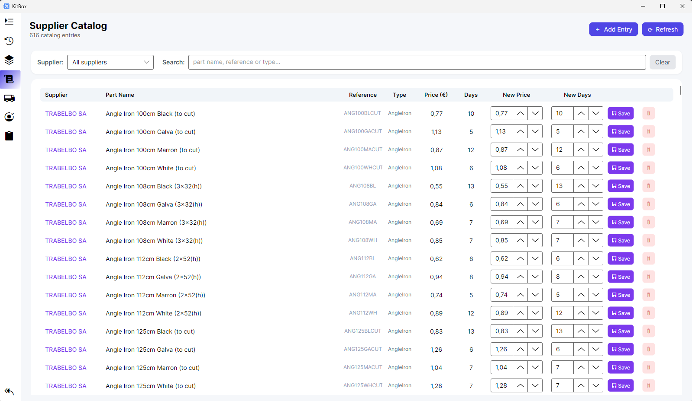
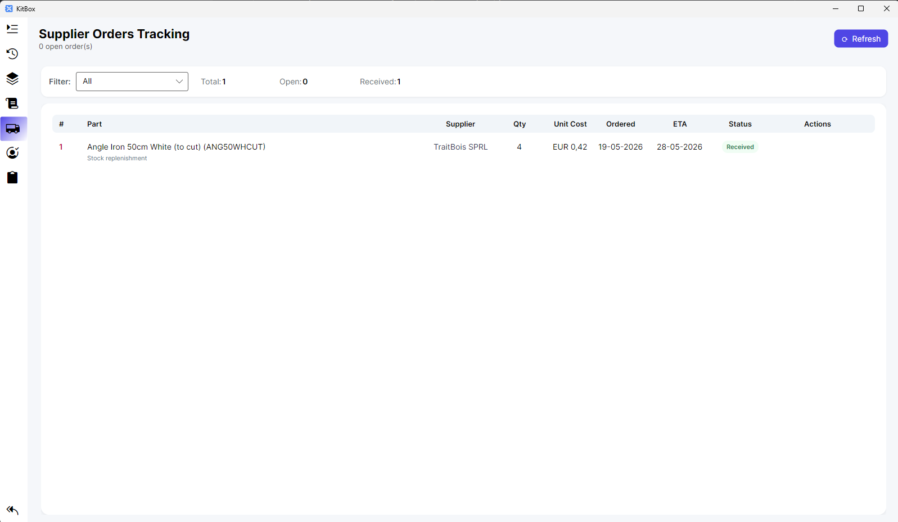

# KitBox — Complete Project Guide

> Desktop application that digitalises the cabinet ordering process for KitBox.
> **Stack**: C# / .NET 9.0 / Avalonia UI 11.3.6 / MariaDB / CommunityToolkit.Mvvm 8.2.1 / BCrypt.Net-Next / LiveChartsCore

> All screenshots in this guide live under `docs/screenshots/`. They are referenced as Markdown placeholders so the document renders even before the images are added — see `docs/screenshots/README.md` for the list of expected files and how to capture them.

---

## Table of contents

1. [Overview](#1-overview)
2. [Prerequisites & installation](#2-prerequisites--installation)
3. [Technical architecture](#3-technical-architecture)
4. [Database](#4-database)
5. [Models layer](#5-models-layer)
6. [DataAccess layer](#6-dataaccess-layer)
7. [Services layer](#7-services-layer)
8. [ViewModels layer](#8-viewmodels-layer)
9. [Views layer (screen by screen)](#9-views-layer-screen-by-screen)
10. [Navigation flow](#10-navigation-flow)
11. [Business processes](#11-business-processes)
12. [What is implemented](#12-what-is-implemented)
13. [What is left to do](#13-what-is-left-to-do)

---

## 1. Overview

KitBox is a cross-platform desktop application that lets:

- **Customers** configure a cabinet (1 to 7 lockers), preview which parts are in stock, and place an order — optionally as a guest.
- **Employees / secretaries** log in (BCrypt-hashed password), then access a multi-page back office: order history, stock management, supplier catalog, supplier-order tracking and a KPI dashboard.
- **The system itself** automatically issues a **supplier order** for the missing quantity whenever a customer order cannot be fully fulfilled from stock, picking the cheapest / fastest supplier.

The application boots on a **Welcome** screen with a single "Click to continue" call-to-action for customers, and a small key icon in the bottom-right corner that takes employees to the login screen.



---

## 2. Prerequisites & installation

### 2.1 Required tools

| Tool | Minimum version |
|---|---|
| .NET SDK | 9.0 |
| MariaDB (or MySQL) | 10.6+ |
| IDE | Visual Studio 2022, Rider, or VS Code with the C# Dev Kit |

### 2.2 Database setup

1. Install MariaDB and start a server you can reach from your machine.
2. Run `schema.sql` (at the root of the repository) to create the `kitbox` database and its 10 tables.
3. Run `seed.sql` to populate the initial data (suppliers, parts, supplier catalog).

```bash
mysql -u root -p < schema.sql
mysql -u root -p < seed.sql
```

### 2.3 `.env` file

Database credentials are read from a `.env` file placed inside `KitBox/`.

1. Copy `.env.example` to `.env`:
   ```bash
   cp KitBox/.env.example KitBox/.env
   ```
2. Edit `KitBox/.env`:
   ```dotenv
   DB_SERVER=localhost
   DB_NAME=kitbox
   DB_USER=root
   DB_PASSWORD=your_password_here
   DB_PORT=3306
   ```

> The `.env` file is git-ignored. Each developer keeps their own copy.

### 2.4 Run the application

```bash
cd KitBox
dotnet run
```

The application opens on the **Welcome** page.

---

## 3. Technical architecture

### 3.1 MVVM pattern

```
┌──────────────────────────────────────────────────┐
│                    Views (.axaml)                 │
│              Layout + XAML bindings               │
└────────────────────┬─────────────────────────────┘
                     │ DataBinding
┌────────────────────▼─────────────────────────────┐
│               ViewModels (.cs)                    │
│        UI logic + Commands + Navigation           │
└────────────────────┬─────────────────────────────┘
                     │ Calls
┌────────────────────▼─────────────────────────────┐
│                Services (.cs)                     │
│  Business rules (validation, pricing, stock,      │
│  supplier selection, order orchestration)         │
└────────────────────┬─────────────────────────────┘
                     │ Calls
┌────────────────────▼─────────────────────────────┐
│              DataAccess (.cs)                     │
│     Repositories (CRUD via MySqlConnector)        │
└────────────────────┬─────────────────────────────┘
                     │ SQL
┌────────────────────▼─────────────────────────────┐
│                  MariaDB                          │
│            Database `kitbox`                      │
└──────────────────────────────────────────────────┘
```

### 3.2 SOLID principles in this codebase

| Principle | Concrete example |
|---|---|
| **SRP** | `OrderService` orchestrates orders, `StockService` owns stock-level logic, `InvoiceExportService` only writes the invoice file. |
| **OCP** | The `Part` hierarchy is open to extension — adding shelves or drawers means a new subclass + a new enum value, not a rewrite. |
| **LSP** | Every `Part` subclass (Panel, Crossbar, Batten, AngleIron, Door, Handle) is interchangeable through `Part`. |
| **ISP** | Each repository has its own focused interface (`IOrderRepository`, `IPartRepository`, `ISupplierOrderRepository`, …). |
| **DIP** | Services depend on `I*Repository` and `I*Service` abstractions; `AppServices` is the composition root that wires concrete implementations. |

### 3.3 Infrastructure files

| File | Role |
|---|---|
| `Program.cs` | Entry point, initialises Avalonia. |
| `App.axaml.cs` | Builds `MainView` with `MainViewModel` as its `DataContext`. |
| `ViewLocator.cs` | Resolves Views from ViewModels by convention (strips `ViewModel`, appends `View`). |
| `EnvConfig.cs` | Reads `KitBox/.env` (one `KEY=VALUE` per line). |
| `AppServices.cs` | Composition root: instantiates every repository and service. |

### 3.4 NuGet dependencies

| Package | Version | Usage |
|---|---|---|
| `Avalonia` / `Avalonia.Desktop` / `Avalonia.Themes.Fluent` / `Avalonia.Fonts.Inter` | 11.3.6 | Cross-platform UI framework. |
| `Avalonia.Diagnostics` | 11.3.6 | DevTools (Debug build only). |
| `Avalonia.Xaml.Interactions` / `Avalonia.Xaml.Interactivity` | 11.3.0.6 | Attached behaviours for XAML. |
| `CommunityToolkit.Mvvm` | 8.2.1 | `[ObservableProperty]`, `[RelayCommand]`, `ObservableObject`. |
| `MySqlConnector` | 2.4.0 | MariaDB/MySQL driver. |
| `BCrypt.Net-Next` | 4.1.0 | Password hashing for employee accounts. |
| `LiveChartsCore` / `LiveChartsCore.SkiaSharpView.Avalonia` | 2.0.0 | Charts used on the back-office Dashboard. |
| `WebView.Avalonia` / `WebView.Avalonia.Desktop` | 11.0.0.1 | Embedded WebView for the 3D preview of the cabinet. |

---

## 4. Database

### 4.1 Schema (10 tables)

```
customer ──1:N──> customer_order ──1:N──> order_line ──N:1──> part
                       │      │                                │
                       │ 0..1 │ 1:N                            │ N:N (supplier_part)
                       ▼      ▼                                │
                     bill  supplier_order ──N:1──> supplier ◄──┘
                       │
customer_order ──1:1──> cabinet ──1:N──> locker

Employee  (independent — back-office login)
```

#### `customer`
| Column | Type | Constraint |
|---|---|---|
| `id` | INT AUTO_INCREMENT | PK |
| `first_name` | VARCHAR(100) | NOT NULL |
| `last_name` | VARCHAR(100) | NOT NULL |
| `email` | VARCHAR(255) | UNIQUE, NOT NULL |
| `phone` | VARCHAR(20) | NULL |

#### `Employee` (back-office login)
| Column | Type | Constraint |
|---|---|---|
| `EmployeeId` | INT AUTO_INCREMENT | PK |
| `FirstName` | VARCHAR(100) | NOT NULL |
| `LastName` | VARCHAR(100) | NOT NULL |
| `Email` | VARCHAR(150) | UNIQUE |
| `PasswordHash` | VARCHAR(255) | BCrypt hash |
| `CreatedAt` | DATETIME | DEFAULT CURRENT_TIMESTAMP |

#### `bill`
| Column | Type | Constraint |
|---|---|---|
| `id` | INT AUTO_INCREMENT | PK |
| `emission_date` | DATE | NOT NULL |
| `amount` | DECIMAL(10,2) | NOT NULL |

#### `customer_order`
| Column | Type | Constraint |
|---|---|---|
| `id` | INT AUTO_INCREMENT | PK |
| `customer_id` | INT | FK → `customer` |
| `bill_id` | INT | FK → `bill` (nullable) |
| `order_date` | DATE | NOT NULL |
| `deposit` | DECIMAL(10,2) | nullable |
| `available_date` | DATE | nullable |
| `status` | ENUM('Pending','PartiallyAvailable','Available','Delivered','Cancelled') | NOT NULL, DEFAULT 'Pending' |

#### `cabinet`
| Column | Type | Constraint |
|---|---|---|
| `id` | INT AUTO_INCREMENT | PK |
| `order_id` | INT | FK → `customer_order` (CASCADE) |
| `angle_iron_color` | VARCHAR(50) | NOT NULL |

#### `locker`
| Column | Type | Constraint |
|---|---|---|
| `id` | INT AUTO_INCREMENT | PK |
| `cabinet_id` | INT | FK → `cabinet` (CASCADE) |
| `height` / `width` / `depth` | DOUBLE | NOT NULL (cm) |
| `color` | VARCHAR(50) | NOT NULL |
| `has_doors` | BOOLEAN | NOT NULL, DEFAULT FALSE |
| `door_color` | VARCHAR(50) | nullable (only used when `has_doors=1`) |

#### `part` (Single Table Inheritance)
| Column | Type | Notes |
|---|---|---|
| `id` | INT AUTO_INCREMENT | PK |
| `reference` | VARCHAR(50) | UNIQUE |
| `name` | VARCHAR(255) | |
| `part_type` | ENUM('Panel','Crossbar','Batten','AngleIron','Door','Handle') | discriminator |
| `height` / `width` / `depth` | DOUBLE | NOT NULL (zero when irrelevant) |
| `color` | VARCHAR(50) | NOT NULL |
| `unit_price` | DECIMAL(10,4) | sale price |
| `stock_quantity` | INT | |
| `minimum_stock` | INT | refreshed from sales history |
| `panel_type` | ENUM('Horizontal','Side','Back') | Panel only |
| `crossbar_type` | ENUM('Front','Back','Side') | Crossbar only |
| `groove_count` | INT | Crossbar only |
| `standard_length` | DOUBLE | AngleIron only |
| `is_glass` | BOOLEAN | Door only |

#### `order_line`
| Column | Type | Constraint |
|---|---|---|
| `id` | INT AUTO_INCREMENT | PK |
| `order_id` | INT | FK → `customer_order` (CASCADE) |
| `part_id` | INT | FK → `part` |
| `quantity` | INT | NOT NULL |
| `unit_price` | DECIMAL(10,4) | price at order time |

#### `supplier`
| Column | Type | Constraint |
|---|---|---|
| `id` | INT AUTO_INCREMENT | PK |
| `name` | VARCHAR(255) | NOT NULL |
| `contact_email` | VARCHAR(255) | NOT NULL |
| `phone` | VARCHAR(20) | nullable |

#### `supplier_part` (supplier catalog)
| Column | Type | Constraint |
|---|---|---|
| `id` | INT AUTO_INCREMENT | PK |
| `supplier_id` | INT | FK → `supplier` (CASCADE) |
| `part_id` | INT | FK → `part` (CASCADE) |
| `price` | DECIMAL(10,4) | NOT NULL |
| `delivery_days` | INT | NOT NULL |
| | | UNIQUE(`supplier_id`, `part_id`) |

#### `supplier_order` (automatic purchase orders)
| Column | Type | Constraint |
|---|---|---|
| `id` | INT AUTO_INCREMENT | PK |
| `customer_order_id` | INT | FK → `customer_order` (CASCADE), nullable for stock replenishments |
| `part_id` | INT | FK → `part` |
| `supplier_id` | INT | FK → `supplier` |
| `quantity` | INT | NOT NULL |
| `unit_cost` | DECIMAL(10,4) | NOT NULL |
| `delivery_days` | INT | NOT NULL |
| `ordered_at` | DATE | NOT NULL |
| `expected_delivery_date` | DATE | NOT NULL |
| `status` | VARCHAR(30) | `Ordered` → `InTransit` → `Received` (or `Cancelled`) |

### 4.2 Performance indexes

Indexes are created on: `customer_order(customer_id)`, `customer_order(status)`, `cabinet(order_id)`, `locker(cabinet_id)`, `order_line(order_id)`, `order_line(part_id)`, `part(part_type)`, `part(stock_quantity, minimum_stock)`, `supplier_part(part_id)`, `supplier_part(price, delivery_days)`, `supplier_order(customer_order_id)`, `supplier_order(expected_delivery_date)`.

### 4.3 Seed data

- **3 suppliers** — PanelPro NV (panels + battens), SteelFix Europe (steel + hardware), KitParts Wholesale (generalist).
- **~100 parts** — battens, crossbars, panels, angle irons, doors, handles, covering the catalog dimensions and colors.
- **Supplier catalog rows** for every part on the three suppliers, with realistic price spreads and delivery times.

---

## 5. Models layer

### 5.1 Enums

| Enum | Values | Usage |
|---|---|---|
| `OrderStatus` | Pending, PartiallyAvailable, Available, Delivered, Cancelled | Customer-order workflow |
| `PanelType` | Horizontal, Side, Back | Panel subtype |
| `CrossbarType` | Front, Back, Side | Crossbar subtype |

### 5.2 `Part` hierarchy

```
            Part (abstract)
        ┌──┬─┴─┬──┬──┬──┐
     Panel Crossbar Batten AngleIron Door Handle
```

| Class | Type-specific properties | Role inside a locker |
|---|---|---|
| `Part` (base) | Id, Reference, Name, Height, Width, Depth, Color, UnitPrice, StockQuantity, MinimumStock | — |
| `Panel` | `Type: PanelType` | 2 horizontal + 2 side + 1 back per locker |
| `Crossbar` | `Type: CrossbarType`, `GrooveCount` | 2 front + 2 back + 4 side per locker |
| `Batten` | — | 4 vertical uprights per locker |
| `AngleIron` | `StandardLength` | 4 per cabinet (length = sum of locker total heights) |
| `Door` | `IsGlass` | 2 optional doors per locker |
| `Handle` | — | 2 cup handles when doors are present, **except glass doors** |

### 5.3 Business entities

| Class | Main properties | Notes |
|---|---|---|
| `Customer` | Id, FirstName, LastName, Email, Phone | Guests get a synthetic email `guest-<token>@guest.kitbox` |
| `Employee` | EmployeeId, Firstname, Lastname, Email, PasswordHash, CreatedAt | Password stored as BCrypt hash |
| `Order` | Id, CustomerId, BillId?, OrderDate, Deposit?, AvailableDate?, Status | Lines & Cabinets are loaded on demand |
| `OrderLine` | Id, OrderId, PartId, Quantity, UnitPrice | `TotalPrice = Quantity × UnitPrice` |
| `Cabinet` | Id, OrderId, AngleIronColor | `MaxLockers = 7` (constant on `Cabinet`) |
| `Locker` | Id, CabinetId, Height, Width, Depth, Color, HasDoors, DoorColor? | `TotalHeight = Height + 2 × 2 cm` |
| `Bill` | Id, EmissionDate, Amount | Created when the order is `Delivered` |
| `Supplier` | Id, Name, ContactEmail, Phone | |
| `SupplierPart` | Id, SupplierId, PartId, Price, DeliveryDays | Plus joined display labels (`PartName`, …) |
| `SupplierOrder` | Id, CustomerOrderId?, PartId, SupplierId, Quantity, UnitCost, DeliveryDays, OrderedAt, ExpectedDeliveryDate, Status | Automatic purchase orders |

---

## 6. DataAccess layer

### 6.1 Connection

`DatabaseConnection` builds a `MySqlConnection` from the env variables read by `EnvConfig`. `GetConnection()` opens and returns a fresh connection.

### 6.2 Repositories (11 pairs Interface / Implementation)

Each repository follows the same pattern: an interface in `DataAccess/Interfaces/`, an implementation in `DataAccess/Repositories/`.

| Repository | Notable operations |
|---|---|
| **CustomerRepository** | GetById, GetAll, Add, Update, Delete |
| **EmployeeRepository** | Async create/get-by-email/verify-password (BCrypt) |
| **OrderRepository** | GetById, GetAll, **GetAllWithDetails()** (LEFT JOIN `customer` + SUM(`order_line`)), GetByCustomerId, Add, Update, Delete |
| **OrderLineRepository** | GetByOrderId, Add, Delete, **GetSoldQuantityByPartSince(partId, fromDate)** (for sales-history-based min stock) |
| **BillRepository** | GetById, Add |
| **CabinetRepository** | GetById, GetByOrderId, Add, Update, Delete |
| **LockerRepository** | GetById, GetByCabinetId, Add, Update, Delete |
| **PartRepository** | GetById, GetByReference, GetAll, GetByType, **GetLowStock()**, Add, Update, **UpdateStock()**, **UpdateMinimumStock()**, Delete |
| **SupplierRepository** | GetById, GetAll, Add, Update, Delete |
| **SupplierPartRepository** | **GetAll()** (JOIN supplier + part), GetByPartId, GetBySupplierId, **GetBestSupplierForPart()**, Add, Update, Delete |
| **SupplierOrderRepository** | GetAll, GetById, GetByCustomerOrderId, Add, **UpdateStatus()** |

**Implementation notes**

- `PartRepository` implements the **Single Table Inheritance**: `MapPart()` reads `part_type` and instantiates the right C# subclass (`Panel`, `Crossbar`, …).
- `OrderRepository.GetAllWithDetails()` joins `customer` and pushes a synthetic `OrderLine` (carrying total parts and total amount) into `Order.Lines` so the history view can render without re-querying.
- `SupplierPartRepository.GetAll()` joins `supplier` and `part` to populate the display labels.

---

## 7. Services layer

### 7.1 `CatalogService`

Hard-coded catalog data (matches the real `kitboxparts.csv`):

| Method | Returns |
|---|---|
| `GetAvailableHeights()` | {32, 42, 52} cm |
| `GetAvailableWidths()` | {32, 42, 52, 62, 80, 100, 120} cm |
| `GetAvailableWidthsWithDoors()` | {32, 42, 52, 62} cm |
| `GetAvailableDepths()` | {32, 42, 52, 62} cm |
| `GetAvailableColors()` | {White, Marron} (locker body) |
| `GetAvailableAngleIronColors()` | {White, Marron, Galva, Black} |
| `GetAvailableDoorColors()` | {White, Marron, Glass} |
| `CrossbarHeight` | 2.0 cm |

### 7.2 `AngleIronCalculatorService`

| Method | Logic |
|---|---|
| `CalculateLockerTotalHeight(locker)` | locker height + 2 × crossbar height (2 cm) |
| `CalculateAngleIronLength(lockers)` | sum of total heights of every locker |

### 7.3 `LockerValidationService`

| Method | Checks |
|---|---|
| `AreDimensionsValid(h, w, d, hasDoors)` | Dimensions belong to the catalog (width is the restricted list when `hasDoors`) |
| `IsLockerCountValid(count)` | `1 ≤ count ≤ 7` |
| `ValidateCabinet(lockers)` | Count valid + **all lockers share the same width** + each locker valid + a door color is set whenever `HasDoors` is on |

### 7.4 `SupplierSelectionService`

| Method | Logic |
|---|---|
| `GetBestSupplier(partId)` | Best price first, then shortest delivery time (SQL `ORDER BY price ASC, delivery_days ASC LIMIT 1`). |

### 7.5 `StockService`

| Method | Behaviour |
|---|---|
| `IsAvailable(partId, qty)` | Part exists AND `stock_quantity ≥ qty`. |
| `GetLowStockParts()` | Returns every part with `stock_quantity < minimum_stock`. |
| `DeductStock(partId, qty)` | Decrement; throws when stock would go negative. |
| `AddStock(partId, qty)` | Increment. |
| `CalculateMinimumStockFromSalesHistory(partId, historyDays=90, coverageDays=30, fallbackMinimum=5)` | Computes a recommended minimum stock from the last *N* days of sales (`OrderLineRepository.GetSoldQuantityByPartSince`); falls back to `fallbackMinimum` when no sales are recorded. |
| `RefreshMinimumStockFromSalesHistory(...)` | Iterates every part and persists the new minimum where it differs. **Called every time the Stock Management page is opened or refreshed.** |
| `GetReplenishmentSuggestions(...)` | Refreshes minimums, then returns a `StockReplenishmentSuggestion` per low-stock part (quantity-to-order, best supplier, price, delivery time). |
| `PlaceReplenishmentOrder(partId, qty?)` | Creates a `SupplierOrder` (status `Ordered`) with the cheapest/fastest supplier; quantity defaults to `MinimumStock - StockQuantity`. |

### 7.6 `SupplierOrderTrackingService`

| Method | Behaviour |
|---|---|
| `GetAll()` | Returns every supplier order. |
| `TransitionStatus(supplierOrderId, newStatus)` | Validates the transition (`Ordered → InTransit → Received`, or `Cancelled` from `Ordered`/`InTransit`). When moved to `Received`, increments the part's `stock_quantity` by the ordered quantity, then calls `RefreshCustomerOrderAvailability()`. |
| `RefreshCustomerOrderAvailability()` | For every `Pending` / `PartiallyAvailable` customer order whose linked supplier orders are **all** in status `Received`, flips the customer order to `Available` and sets `AvailableDate = today`. |

### 7.7 `InvoiceExportService`

Writes a `.txt` document into the current user's **Downloads** folder (`%USERPROFILE%/Downloads`). Used in two places:

- When the customer confirms an order in **Order Summary** (a deposit receipt or an immediate-payment invoice).
- When the secretary clicks **Generate Bill** in **Order History** (a final-payment invoice).

File name pattern: `kitbox_<document_type>_order_<orderId>_<yyyyMMdd_HHmmss>.txt`.

### 7.8 `OrderService`

#### `PreviewOrder(lockers, angleIronColor)` → `OrderPreview`

1. `BuildRequirements()` decomposes the cabinet into part requirements.
2. For each requirement, the matching part is searched in the DB via `FindPart()`.
3. Stock availability and unit price are recorded.
4. Returns an `OrderPreview` with a `List<PartAvailability>`, the total angle-iron length, the total price and an `AllPartsAvailable` flag.

#### `PlaceOrder(customer, lockers, angleIronColor, depositAmount)` → `Order`

1. Calls `PreviewOrder` to compute the breakdown.
2. Persists the customer if `Id == 0`.
3. Creates the `Order`:
   - Status **Available** when every part is in stock,
   - otherwise **PartiallyAvailable** with the deposit recorded.
4. Creates the `Cabinet` and its `Locker` rows.
5. For each requirement:
   - Persists an `OrderLine`.
   - **Deducts** the available portion of the stock.
   - If a shortage remains, picks the best supplier and creates a **`SupplierOrder` automatically** (`Ordered`, ETA = today + delivery_days). The customer order's `AvailableDate` is set to the **latest** ETA across all supplier orders generated for it (fallback: today + 14 days).
6. Returns the persisted order.

#### `BuildRequirements()`

For **each locker**:

| Part | Quantity | Matched on |
|---|---|---|
| Batten | 4 | height (no color, universal) |
| Front Crossbar | 2 | width (no color) |
| Back Crossbar | 2 | width (no color) |
| Side Crossbar | 4 | depth (no color) |
| Horizontal Panel | 2 | width × depth, locker color |
| Side Panel | 2 | height × depth, locker color |
| Back Panel | 1 | height × width, locker color |
| Door (if doors) | 2 | height × width, door color, `is_glass` flag |
| Handle (if doors, not glass) | 2 | universal |

For the **whole cabinet**:

| Part | Quantity | Dimension |
|---|---|---|
| Angle Iron | 4 | length = sum of locker total heights, angle-iron color |

#### `FindPart()`

Matches by `part_type`, subtype (`panel_type` / `crossbar_type`), non-zero dimensions (±0.01 tolerance), color, and `is_glass` for doors. Returns `null` when no row matches — the requirement is then reported as "not available" in the preview.

---

## 8. ViewModels layer

### 8.1 `MainViewModel` — navigation hub

Owns `CurrentPage` (the active ViewModel) and `Services` (the `AppServices` composition root). The default landing page is `WelcomePageViewModel`.

| Helper | Target page |
|---|---|
| `GoToWelcomePage()` | Welcome |
| `GoToCustomerSelection()` | Employee login |
| `GoToEmployeeInscription()` | Employee registration |
| `GoToSecretaryMenu()` | New secretary menu (sidebar shell) |
| `GoToSupplierCatalog()` | Supplier catalog |
| `GoToSupplierOrderTracking()` | Supplier orders tracking |
| `GoToOrderHistory()` | Order history |
| `GoToOwnerDashboard()` | Stock management |
| `GoToDashboard()` | KPI dashboard |
| `GoToCabinetConfiguration(customer)` | Cabinet builder |
| `GoToOrderSummary(customer, lockers, color)` | Order preview / confirm |
| `GoToHome()` | Legacy home page (unused in the production flow) |

### 8.2 `WelcomePageViewModel`

Default landing screen. Two commands:

- `ContinueAsGuest` → creates a synthetic `Customer` (`guest-<token>@guest.kitbox`) and navigates to **Cabinet Configuration**.
- `GoToConnexionMenu` → navigates to the employee login screen.

### 8.3 `CustomerSelectionViewModel` — Employee login

Despite the historical name, this page is now an **employee login** form. It reads `Email` and `Password`, then `EmployeeRepository.GetByEmailAsync(email)` is called and the password is verified with BCrypt (`VerifyPassword`). On success the user is forwarded to `NewSecretaryMenuViewModel`. The screen exposes an `ErrorMessage`, a `RememberMe` flag, and a `GoToWelcomePage` command for the back button.

### 8.4 `EmployeeInscriptionViewModel`

Form to create a new employee:

- Fields: `FirstName`, `LastName`, `Email`, `Password`, `ConfirmPassword`.
- `RegisterEmployee` checks `Password == ConfirmPassword`, BCrypt-hashes the password and calls `EmployeeRepository.CreateAsync(employee)`.
- `Cancel` clears the form.
- `GotoSecretaryMenu` goes back to the secretary menu.

### 8.5 `NewSecretaryMenuViewModel` — back-office shell

This is the **main back-office layout**. It owns a collapsible left sidebar and a `CurrentMenuPage` placeholder that swaps between five inner ViewModels (instantiated once and reused):

- `OwnerDashboardViewModel` — Stock management
- `SupplierCatalogViewModel` — Supplier catalog
- `OrderHistoryViewModel` — Order history (default landing tab)
- `SupplierOrderTrackingViewModel` — Supplier orders tracking
- `DashBoardViewModel` — KPI dashboard

The `SideMenuResize` command toggles `SideMenuExpanded` between an icons-only rail and a full-width menu. The `Back` command returns to the Welcome page.

### 8.6 `CabinetConfigurationViewModel`

Cabinet builder:

- Holds an `ObservableCollection<LockerConfigViewModel>` (1 to 7).
- `AddLocker` / `RemoveLocker` commands enforce the range.
- `AngleIronColor` is selected from `CatalogService.GetAvailableAngleIronColors()`.
- Every property change on a locker (or on the angle-iron color) raises an `OnRefresh3D` event with a JSON snapshot. The view subscribes to it and forwards it to the embedded WebView to redraw the live 3D preview.
- `Proceed` converts the locker VMs into `Locker` entities, runs them through `LockerValidationService.ValidateCabinet()` and navigates to **Order Summary** when valid (showing the validation errors otherwise).
- `Back` returns to the Welcome page.

### 8.7 `LockerConfigViewModel`

One locker, edited inline:

- Combo-boxes wired to `CatalogService` for Height / Width / Depth / Color / DoorColor.
- A `HasDoors` checkbox; when toggled, the Width list is replaced with `GetAvailableWidthsWithDoors()`.
- `ToLocker()` produces a `Locker` model with the selected values.

### 8.8 `OrderSummaryViewModel`

- `LoadPreview()` calls `OrderService.PreviewOrder()` and fills the parts grid.
- `DepositAmount` defaults to 30 % of the total when at least one part is missing.
- `PlaceOrder` calls `OrderService.PlaceOrder()`, then:
  - emits a **deposit receipt** TXT into Downloads (partial availability), or
  - an **immediate-payment invoice** TXT (all parts available).
- `Back` returns to the cabinet builder; `ReturnToStart` jumps back to the Welcome screen after confirmation.

### 8.9 `OwnerDashboardViewModel` — Stock management

- On every `Refresh`, calls `StockService.RefreshMinimumStockFromSalesHistory()` so the minimums match the last 90 days of sales.
- Loads every part via `PartRepository.GetAll()` and wraps them in `StockItemViewModel` rows.
- Each row exposes: type, name, reference, current stock, minimum, a low-stock badge, a `NewQuantity` editor with a `SaveStock` command, the **best supplier** for this part, a **recommended replenishment quantity**, and a `OrderFromBestSupplier` command that calls `StockService.PlaceReplenishmentOrder` (a `SupplierOrder` is then created).

### 8.10 `SecretaryMenuViewModel` (legacy menu)

Older flat menu still present in the codebase. Wired commands: `GoToSupplierCatalog`, `GoToStockManagement`, `GoToOrderHistory`, `GoToSupplierOrdersTracking`, `GoToEmployeeInscription`, `Back`. The primary back-office shell in use today is `NewSecretaryMenuViewModel`; this legacy ViewModel is reached again from a few `Back` commands inside its inner pages.

### 8.11 `SupplierCatalogViewModel`

- Loads every `SupplierPart` row via `SupplierPartRepository.GetAll()` (joined with `supplier` and `part`).
- Filtering: by supplier (ComboBox) and / or free-text (matches name, reference and type).
- Inline edit of `price` and `delivery_days` (NumericUpDown) with a `Save` button.
- Expandable form to add a new entry: supplier, part id, price, delivery days.
- Delete button per row.

### 8.12 `OrderHistoryViewModel`

Order tracking and lifecycle:

- Loads `OrderRepository.GetAllWithDetails()`.
- Filters by status (`All`, `Pending`, `PartiallyAvailable`, `Available`, `Delivered`, `Cancelled`).
- Per row (`OrderItemViewModel`), conditional actions:

| Action | Condition | Effect |
|---|---|---|
| ✓ Available | `Status = PartiallyAvailable` | Move to `Available`, set `AvailableDate = today` |
| 📦 Delivered | `Status = Available` | Move to `Delivered` |
| 🧾 Bill | `Status = Delivered` AND no `BillId` | Create a `Bill` (`amount = total − deposit`) and export a final-payment TXT invoice to Downloads |
| ✕ Cancel | Status not in {`Delivered`, `Cancelled`} | Restores stock for the **quantities actually consumed at order creation** (not for what was passed on to the supplier), then moves to `Cancelled` |

### 8.13 `SupplierOrderTrackingViewModel`

Tracks every automatic purchase order:

- Loads via `SupplierOrderTrackingService.GetAll()`, joined client-side with part labels (`PartRepository.GetAll()`) and supplier labels (`SupplierRepository.GetAll()`).
- KPIs at the top: Total / Open / Received.
- Filter by status (`All`, `Ordered`, `InTransit`, `Received`, `Cancelled`).
- Per row, conditional actions: **Transit**, **✓ Receive**, **✕ Cancel** — all routed through `SupplierOrderTrackingService.TransitionStatus`. Marking a supplier order as **Received** increments stock and (if every supplier order linked to a customer order is now received) flips that customer order to **Available**.

### 8.14 `DashBoardViewModel`

KPI placeholder for the back office (cards for stock-out count, revenue, total ordered parts, most-used material, total orders, share of orders with deposit) and a horizontal chart strip (LiveCharts) — most binding targets and chart bindings are stubs to be filled in.

### 8.15 Other ViewModels

`StartPageViewModel`, `HomePageViewModel`, `PartAvailabilityViewModel`, `ViewModelBase` are utility / legacy ViewModels still present in the codebase.

---

## 9. Views layer (screen by screen)

All views are `.axaml` files with a minimal code-behind (`InitializeComponent()` only). Shared styles live in `Styles/AppDefaultStyle.axaml`.

### 9.1 `MainView.axaml`

Main window. Contains a single `ContentControl` bound to `CurrentPage`. The `ViewLocator` resolves each child View from its ViewModel by convention.

### 9.2 Welcome screen — `WelcomePageView.axaml`

Large italic indigo "KitBox" title, a single **Click to continue** button (jumps straight into the cabinet builder as a guest), and a small key icon in the bottom-right corner for employees to reach the login screen.


### 9.3 Employee login — `CustomerSelectionView.axaml`

Email + password form, BCrypt verification. On success the user lands on the secretary menu.



### 9.4 Employee registration — `EmployeeInscriptionView.axaml`

Form to create a new employee account (first name, last name, email, password, confirm password, with show/hide toggles). Reachable from the legacy `SecretaryMenuView`.


### 9.5 Back-office shell — `NewSecretaryMenuView.axaml`

Two-column layout: a collapsible left rail with navigation buttons (Order history, Stock management, Supplier catalog, Order tracking, Dashboard, Go back) and a `ContentControl` on the right that renders the currently-active inner page.


### 9.6 Cabinet builder — `CabinetConfigurationView.axaml`

Indigo header with the current "N/7 lockers" counter, a scrollable list of locker rows (Height, Width, Depth, Color, Has Doors?, Door color), an `Add Locker` button, an angle-iron color combo-box, an amber validation banner, and a **Preview Order →** action. The right pane embeds a WebView that renders a live Three.js preview of the cabinet, refreshed each time a locker property changes.



### 9.7 Order summary — `OrderSummaryView.axaml`

Header with the customer name, info card (locker count, angle-iron length, color), parts table with availability badges (green = in stock, red = missing), total price, deposit area (amber) when partial, and a **Confirm Order ✓** button. When confirmed, a TXT invoice or receipt is downloaded to the user's Downloads folder.



### 9.8 Order history — `OrderHistoryView.axaml`

Header (teal `#0F766E`), status filter combo-box, 10-column table with status-colored badges and conditional inline actions per row (✓ Available, 📦 Delivered, 🧾 Bill, ✕ Cancel).



### 9.9 Stock management — `OwnerDashboardView.axaml`

Header (dark grey `#374151`) with low-stock counter, then a per-part table: name, type, reference, current stock, minimum, status badge, new-quantity editor + **Save**, best supplier summary, and a **Order from best supplier** button when stock is below minimum. Low rows are highlighted orange.



### 9.10 Supplier catalog — `SupplierCatalogView.axaml`

Violet header (`#7C3AED`), filter bar (supplier combo + free-text search + Clear), expandable "add new entry" form, and a 10-column table with inline editing for `price` and `delivery_days` (NumericUpDown + Save), plus a delete button.



### 9.11 Supplier orders tracking — `SupplierOrderTrackingView.axaml`

Header with KPI strip (Total / Open / Received), status filter, and a row per supplier order: id, part label, supplier label, qty, unit cost, ordered date, ETA, status badge, conditional actions (**Transit**, **✓ Receive**, **✕ Cancel**). The customer order id is shown as a sub-line ("Customer order #N" or "Stock replenishment").



### 9.12 KPI dashboard — `DashBoardView.axaml`

Title "Dashboard KitBox", a 3×2 grid of KPI cards, and a horizontally scrollable strip of six chart placeholders for LiveCharts (orders over time, locker types, critical stock, monthly revenue, order conformity rate, parts per supplier).


### 9.13 Shared styles

`Styles/AppDefaultStyle.axaml` defines: navigation buttons (`NavButton` with `.active` modifier), the start-page buttons, card backgrounds, icon fonts (Phosphor / Akko icons used in the sidebar).

---

## 10. Navigation flow

```
WelcomePageView
├── [Click to continue]  → CabinetConfigurationView (as guest)
│       ├── [Preview Order →] → OrderSummaryView
│       │     ├── [Confirm Order ✓] (TXT downloaded; stays on page with status)
│       │     ├── [← New Order]       → WelcomePageView
│       │     └── [← Back]              → CabinetConfigurationView
│       └── [← Back]                    → WelcomePageView
│
└── [Key icon] → CustomerSelectionView (employee login)
        └── [Login] → NewSecretaryMenuView (shell)
                ├── [Order history]            → OrderHistoryView      (default tab)
                ├── [Stock management]         → OwnerDashboardView
                ├── [Supplier catalog]         → SupplierCatalogView
                ├── [Order tracking]           → SupplierOrderTrackingView
                ├── [Dashboard]                → DashBoardView
                └── [Go back]                  → WelcomePageView

(Legacy paths still in code)
SecretaryMenuView ── [Register employee] → EmployeeInscriptionView
```

---

## 11. Business processes

### 11.1 Customer ordering workflow

```
1. Customer hits "Click to continue" on the Welcome screen.
   → A guest customer is created in memory.
2. Cabinet builder:
   a. Adds 1–7 lockers.
   b. Picks Height / Width / Depth / Color for each locker.
   c. Optionally toggles "Has doors" + picks a door color (incl. "Glass").
   d. Picks the angle-iron color.
   e. The live 3D preview updates after every change.
3. Click "Preview Order" → LockerValidationService validates the cabinet
   (all lockers same width, each dimension in the catalog, door color
   required when doors are on).
4. Order Summary:
   a. OrderService.PreviewOrder decomposes the cabinet, looks up each
      part, reports availability and total price.
   b. If everything is in stock → status will be "Available", no deposit.
   c. Otherwise → 30 % deposit is suggested.
5. Confirm Order:
   a. Customer is persisted (new row).
   b. Order, Cabinet, Lockers, OrderLines are persisted.
   c. Stock is deducted for the quantity actually available.
   d. For any shortage, a SupplierOrder is created automatically with
      the cheapest/fastest supplier. AvailableDate = latest ETA across
      those supplier orders (fallback: today + 14 days).
   e. A TXT receipt / invoice is written to the user's Downloads folder.
```

### 11.2 Supplier catalog management

```
1. Employee logs in → Supplier catalog tab.
2. Filter by supplier and/or free text.
3. Edit price and delivery_days inline → Save → UPDATE supplier_part.
4. Add a new entry through the expandable form.
5. Delete an entry through the trash icon.
```

### 11.3 Stock management

```
1. Employee → Stock management tab.
2. Opening the page recomputes minimum_stock from the last 90 days
   of sales (RefreshMinimumStockFromSalesHistory).
3. Low-stock rows are highlighted orange and badged "⚠ Low".
4. Replenish through "Order from best supplier" → a SupplierOrder
   with the cheapest/fastest supplier is created (status Ordered).
5. The supplier order then lives in the "Order tracking" tab.
```

### 11.4 Customer-order lifecycle

```
Pending / PartiallyAvailable ──[✓ Available]──→ Available
                                                     │
                                            [📦 Delivered]
                                                     │
                                                     ▼
                                                  Delivered
                                                     │
                                              [🧾 Bill]   → Final-payment TXT
                                                     │       written to Downloads
                                                     ▼
                                              Bill created
                                              (amount = total − deposit)

Any status except Delivered / Cancelled ──[✕ Cancel]──→ Cancelled
   (only the quantities actually consumed from stock at order
    creation are restored — quantities passed on to a supplier
    are NOT restored, since they are tracked via supplier orders.)
```

### 11.5 Supplier-order lifecycle

```
Ordered ──[Transit]──→ InTransit ──[✓ Receive]──→ Received  (stock += qty)
   │                       │
   │                       └─[✕ Cancel]──→ Cancelled
   │
   └─[✓ Receive]──→ Received
   │
   └─[✕ Cancel]──→ Cancelled

When the LAST supplier order linked to a customer order is "Received",
that customer order is flipped to "Available" automatically and its
AvailableDate is set to today (RefreshCustomerOrderAvailability).
```

### 11.6 Supplier selection rule

```
1. Cheapest price first.
2. On a tie, shortest delivery time.
3. SQL: ORDER BY price ASC, delivery_days ASC LIMIT 1.
```

### 11.7 Worked example — decomposition

A cabinet with two lockers: (H32 × W62 × D42, White) and (H42 × W62 × D42, Marron, with White doors).

**Locker 1** (32 × 62 × 42, White, no doors)
- 4 Battens H=32
- 2 Front Crossbars W=62
- 2 Back Crossbars W=62
- 4 Side Crossbars D=42
- 2 Horizontal Panels 62×42 White
- 2 Side Panels 32×42 White
- 1 Back Panel 32×62 White

**Locker 2** (42 × 62 × 42, Marron, White doors)
- 4 Battens H=42
- 2 Front Crossbars W=62
- 2 Back Crossbars W=62
- 4 Side Crossbars D=42
- 2 Horizontal Panels 62×42 Marron
- 2 Side Panels 42×42 Marron
- 1 Back Panel 42×62 Marron
- 2 Doors H=42 W=62 White (`is_glass=0`)
- 2 Handles

**Cabinet**
- Total angle-iron length = (32 + 4) + (42 + 4) = 82 cm
- 4 Angle Irons of 82 cm in the chosen angle-iron color

Total: ~34 individual parts checked against stock.

---

## 12. What is implemented

### Architecture
- [x] MVVM with Avalonia UI.
- [x] Repository + Service layer.
- [x] `AppServices` composition root.
- [x] `ViewLocator` by convention.
- [x] `.env`-based configuration.
- [x] 10-table schema + performance indexes.
- [x] Seed data with ~100 parts and 3 suppliers.

### Customer flow
- [x] Welcome screen + guest mode.
- [x] Cabinet builder (1–7 lockers, per-locker dimensions / color / doors).
- [x] Live 3D preview (WebView + Three.js).
- [x] Cabinet validation (uniform width, valid dimensions, door color required when doors are on).
- [x] Automatic decomposition into parts.
- [x] Per-part stock availability + total price.
- [x] Deposit handling for partial availability (30 % suggested).
- [x] Order persistence with cabinet + lockers + lines.
- [x] **Automatic supplier orders** for any shortage, with the customer order's `AvailableDate` set to the latest ETA.
- [x] Stock deduction on confirmation.
- [x] **TXT invoice / receipt** exported to Downloads at confirmation.

### Back-office
- [x] Employee login (BCrypt) + employee registration.
- [x] Collapsible-sidebar shell with 5 tabs.
- [x] Order history with status filter, lifecycle actions and final-payment TXT.
- [x] Stock management with low-stock highlight, **sales-history-based minimum stock**, and per-row "Order from best supplier".
- [x] Supplier catalog with filtering, inline edit, add and delete.
- [x] Supplier-orders tracking with status transitions; receiving an order restocks parts and auto-flips matching customer orders to Available.
- [x] Stock restored on cancellation (only the quantity consumed from local stock).

### Business logic
- [x] Best supplier picked by price-then-delay.
- [x] Angle-iron length computed from locker total heights.
- [x] Catalog-driven dimension validation.
- [x] Single Table Inheritance for parts.

---

## 13. What is left to do

### Missing features

| Priority | Feature | Detail |
|---|---|---|
| **High** | True payment integration | Today the app records a deposit and exports a TXT invoice — no payment provider is wired up. |
| **High** | Returns and refunds | No return workflow is implemented yet. |
| **Medium** | Proper invoice export (PDF / print) | Bills exist in DB and a `.txt` is dropped in Downloads; a real PDF / printable invoice is still TODO. |
| **Medium** | KPI dashboard wiring | The dashboard layout is ready but bindings are placeholders — the LiveCharts series and the KPI text blocks still need real data sources. |
| **Medium** | Existing-customer flow | The order flow always creates a new (guest) customer; a "find existing customer by email" path is missing. |
| **Medium** | Customer notifications | No email / push notification is sent when a customer order becomes Available. |
| **Low** | Additional `Part` subclasses | Shelves, drawers and similar accessories can be added (extension points exist). |
| **Low** | Legacy entry points (`StartPageView`, `HomePageView`, legacy `SecretaryMenuView`) | Either remove them or fold them into the navigation graph. |
| **Low** | Automated tests | No unit / integration tests yet. |
| **Low** | Offline / resilient mode | DB errors are surfaced to the user but there's no retry / cache. |

### Technical improvements

| Improvement | Detail |
|---|---|
| Real DI container | Replace `AppServices` with `Microsoft.Extensions.DependencyInjection`. |
| Unit / integration tests | xUnit or NUnit with mocked repositories; integration tests against a containerised MariaDB. |
| Async DB access | Most repository methods are still synchronous. |
| Logging | Add Serilog or NLog. |
| SQL transactions | `PlaceOrder` writes to 5 tables (order, cabinet, locker, order_line, supplier_order) without an explicit transaction. |
| Stronger input validation | Email regex, phone formatting, locker dimension cross-checks. |
| Catalog caching | `CatalogService` is static, but DB lookups (parts, suppliers) could be cached as well. |

### Navigation polish

| Issue | Detail |
|---|---|
| Legacy `SecretaryMenuView` still reachable | A few `Back` actions land on it instead of `NewSecretaryMenuView`. |
| 3D preview | The WebView preview should gracefully degrade when the bundled HTML / textures can't be loaded. |

---

## Appendix — File layout

```
Software-Engineering-Project/
├── context.md                          # Original brief
├── schema.sql                          # DB schema (10 tables)
├── seed.sql                            # Initial data
├── PROJECT_GUIDE.md                    # This document
├── README.md
│
├── docs/
│   ├── database-design.md
│   ├── fournisseurs.txt
│   ├── kitboxparts.csv
│   └── screenshots/                    # Drop screenshots here (see README)
│
└── KitBox/
    ├── .env.example                    # Credentials template
    ├── KitBox.csproj                   # .NET 9.0
    ├── KitBox.sln
    ├── Program.cs                      # Entry point
    ├── App.axaml(.cs)                  # Avalonia app
    ├── ViewLocator.cs                  # View ↔ ViewModel resolution
    ├── EnvConfig.cs                    # Reads .env
    ├── AppServices.cs                  # Composition root
    │
    ├── Models/
    │   ├── Enums/
    │   │   ├── OrderStatus.cs
    │   │   ├── PanelType.cs
    │   │   └── CrossbarType.cs
    │   ├── Parts/
    │   │   ├── Part.cs (abstract)
    │   │   ├── Panel.cs
    │   │   ├── Crossbar.cs
    │   │   ├── Batten.cs
    │   │   ├── AngleIron.cs
    │   │   ├── Door.cs
    │   │   └── Handle.cs
    │   ├── Customer.cs
    │   ├── Employee.cs
    │   ├── Order.cs
    │   ├── OrderLine.cs
    │   ├── Cabinet.cs
    │   ├── Locker.cs
    │   ├── Bill.cs
    │   ├── Supplier.cs
    │   ├── SupplierPart.cs
    │   └── SupplierOrder.cs
    │
    ├── DataAccess/
    │   ├── DatabaseConnection.cs
    │   ├── Interfaces/
    │   │   ├── IBillRepository.cs
    │   │   ├── ICustomerRepository.cs
    │   │   ├── IEmployeeRepository.cs
    │   │   ├── IOrderRepository.cs
    │   │   ├── IOrderLineRepository.cs
    │   │   ├── ICabinetRepository.cs
    │   │   ├── ILockerRepository.cs
    │   │   ├── IPartRepository.cs
    │   │   ├── ISupplierRepository.cs
    │   │   ├── ISupplierPartRepository.cs
    │   │   └── ISupplierOrderRepository.cs
    │   └── Repositories/
    │       ├── BillRepository.cs
    │       ├── CustomerRepository.cs
    │       ├── EmployeeRepository.cs
    │       ├── OrderRepository.cs
    │       ├── OrderLineRepository.cs
    │       ├── CabinetRepository.cs
    │       ├── LockerRepository.cs
    │       ├── PartRepository.cs
    │       ├── SupplierRepository.cs
    │       ├── SupplierPartRepository.cs
    │       └── SupplierOrderRepository.cs
    │
    ├── Services/
    │   ├── Interfaces/                 # ICatalogService, IOrderService, …
    │   ├── CatalogService.cs
    │   ├── AngleIronCalculatorService.cs
    │   ├── LockerValidationService.cs
    │   ├── SupplierSelectionService.cs
    │   ├── SupplierOrderTrackingService.cs
    │   ├── StockService.cs
    │   ├── OrderService.cs
    │   └── InvoiceExportService.cs
    │
    ├── ViewModels/
    │   ├── ViewModelBase.cs
    │   ├── MainViewModel.cs
    │   ├── WelcomePageViewModel.cs
    │   ├── StartPageViewModel.cs          (legacy)
    │   ├── HomePageViewModel.cs           (legacy)
    │   ├── CustomerSelectionViewModel.cs  (employee login)
    │   ├── EmployeeInscriptionViewModel.cs
    │   ├── NewSecretaryMenuViewModel.cs
    │   ├── SecretaryMenuViewModel.cs      (legacy)
    │   ├── CabinetConfigurationViewModel.cs
    │   ├── LockerConfigViewModel.cs
    │   ├── OrderSummaryViewModel.cs
    │   ├── PartAvailabilityViewModel.cs
    │   ├── OwnerDashboardViewModel.cs
    │   ├── SupplierCatalogViewModel.cs
    │   ├── OrderHistoryViewModel.cs
    │   ├── SupplierOrderTrackingViewModel.cs
    │   └── DashBoardViewModel.cs
    │
    ├── Views/                           # .axaml + .axaml.cs for every VM above
    │
    └── Styles/
        └── AppDefaultStyle.axaml
```
