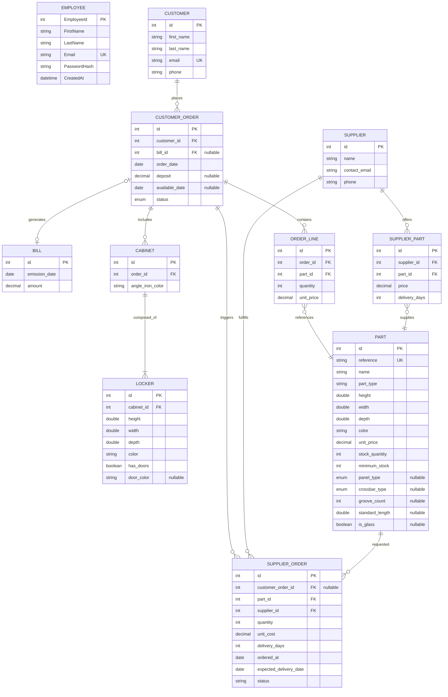

# KitBox - In-store Cabinet Ordering and Inventory System

KitBox is a desktop application used in store to configure modular cabinets, validate orders, and manage stock and supplier purchasing. It replaces the paper order process with a guided workflow that prevents invalid cabinet combinations and automates procurement when items are missing.

Note: `context.md` requires documentation and diagrams in English. This README is written in English to comply.

## Table of contents

1. Overview
2. How the application works
3. Core business rules and validations
4. Architecture and modules
5. Database schema
6. Business logic details
7. Setup and run
8. Requirements coverage (context.md)

## 1. Overview

The application supports three main roles:

- Customer flow: configure a cabinet (1 to 7 lockers), preview parts and pricing, and place an order.
- Secretary flow: maintain supplier catalogs, manage stock, track orders, and generate invoices.
- Owner/manager flow: monitor stock health and trigger replenishment.

Key outcomes:

- Reduce order mistakes by validating cabinet constraints and parts compatibility.
- Support partial availability with deposit handling and later pickup.
- Optimize stock and suppliers based on price, delivery time, and sales history.

## 2. How the application works

End-to-end flow (typical order):

1. Employee signs in and selects the customer context.
2. The cabinet is configured (locker sizes, colors, optional doors).
3. The system decomposes the cabinet into required parts and checks stock.
4. A full price and availability preview is presented.
5. On confirmation:
   - The order, cabinet, lockers, and order lines are persisted.
   - Stock is deducted for available quantities.
   - Missing quantities trigger supplier orders automatically.
   - The availability date is calculated based on supplier lead times.
6. Order lifecycle progresses: Pending -> PartiallyAvailable -> Available -> Delivered.
7. At delivery, the invoice is generated and exported.

## 3. Core business rules and validations

These rules are enforced in the services layer and reflected in the UI:

- A cabinet contains 1 to 7 lockers.
- All lockers inside the same cabinet share the same width.
- Door widths are constrained to available door sizes.
- Panel color is consistent per locker, door color can differ.
- Total locker height = batten height + 2 x 2 cm (crossbars).
- Angle iron length = sum of total heights for all lockers.
- Parts are not stored as cabinets; cabinets are decomposed into parts.

## 4. Architecture and modules

The application uses MVVM with a layered architecture:

- Views (.axaml): UI layout and bindings.
- ViewModels: UI logic, commands, navigation.
- Services: business rules and calculations.
- DataAccess: repositories for SQL persistence.

Important services:

- `CatalogService`: available dimensions and colors.
- `LockerValidationService`: cabinet validation rules.
- `AngleIronCalculatorService`: total height and angle iron length.
- `OrderService`: order preview, persistence, and status transitions.
- `StockService`: stock checks and adjustments.
- `SupplierSelectionService`: best supplier by price then delivery.
- `InvoiceExportService`: TXT exports for deposit and final invoice.
- `SupplierOrderTrackingService`: supplier order status handling.

## 5. Database schema

Source of truth: `schema.sql`. Core tables:

- `Employee`: authenticated users (passwords stored as BCrypt hashes).
- `Customer`: client identity and contact.
- `Customer_Order`: order header, status, deposit, availability date.
- `Cabinet` and `Locker`: cabinet structure.
- `Part`: all parts using single-table inheritance (STI).
- `Order_Line`: quantities and prices of parts in an order.
- `Supplier` and `Supplier_Part`: supplier catalog with prices and lead times.
- `Supplier_Order`: purchase orders triggered by shortages.
- `Bill`: invoices generated at delivery.

Entity-relationship diagram:



## 6. Business logic details

Order preview and parts decomposition:

- Lockers are expanded into required parts (panels, crossbars, battens, doors, handles).
- Each required part is matched to the catalog (`Part` table).
- Availability and total price are computed before confirmation.

Stock and supplier logic:

- Minimum stock is computed from sales history using `order_line` and `customer_order.order_date`.
- When an item is missing, a supplier order is created.
- Supplier selection is ordered by lowest price, then shortest delivery time.

Order lifecycle:

- If all parts are in stock, the order is fully available.
- If not, the order moves to PartiallyAvailable and a deposit is recorded.
- Availability date is based on the longest supplier lead time.
- On delivery, the invoice amount equals total price minus deposit.
- TXT receipts and invoices are exported to the user Downloads folder.

## 7. Setup and run

Prerequisites:

- .NET SDK 9.0
- MariaDB or MySQL

Database setup:

```bash
mysql -u root -p < schema.sql
mysql -u root -p kitbox < seed.sql
```

Environment configuration:

Create `KitBox/.env`:

```dotenv
DB_SERVER=localhost
DB_NAME=kitbox
DB_USER=root
DB_PASSWORD=your_password
DB_PORT=3306
```

Run the application:

```bash
cd KitBox
dotnet run
```

Default employee login (seeded):

- Email: Kitbox
- Password: kitbox 2026

## 8. Requirements coverage (context.md)

Below is a direct mapping to the context requirements:

- Digitize cabinet ordering to reduce errors: UI-driven configuration, validation services, and parts preview prevent incompatible orders.
- Partial availability with deposit and later pickup: `customer_order.status`, `deposit`, and `available_date` model this flow; invoices are issued at delivery.
- Multiple suppliers per part: `supplier_part` implements the many-to-many relationship.
- Minimum stock from sales history: stock thresholds are recalculated from historical `order_line` data.
- Best supplier by price then delivery time: enforced by `SupplierSelectionService` and SQL ordering.
- Cabinet composition rules: locker validation, angle iron length calculation, and parts decomposition match the domain rules.
- Extensibility for new components: `Part` uses single-table inheritance with a `part_type` discriminator and type-specific columns.
- SOLID architecture: responsibilities are split across ViewModels, Services, and Repositories, with interfaces at the DataAccess boundary.

If strict compliance with the language constraints in `context.md` is required (English UI strings and comments), review remaining UI labels and messages for translation.