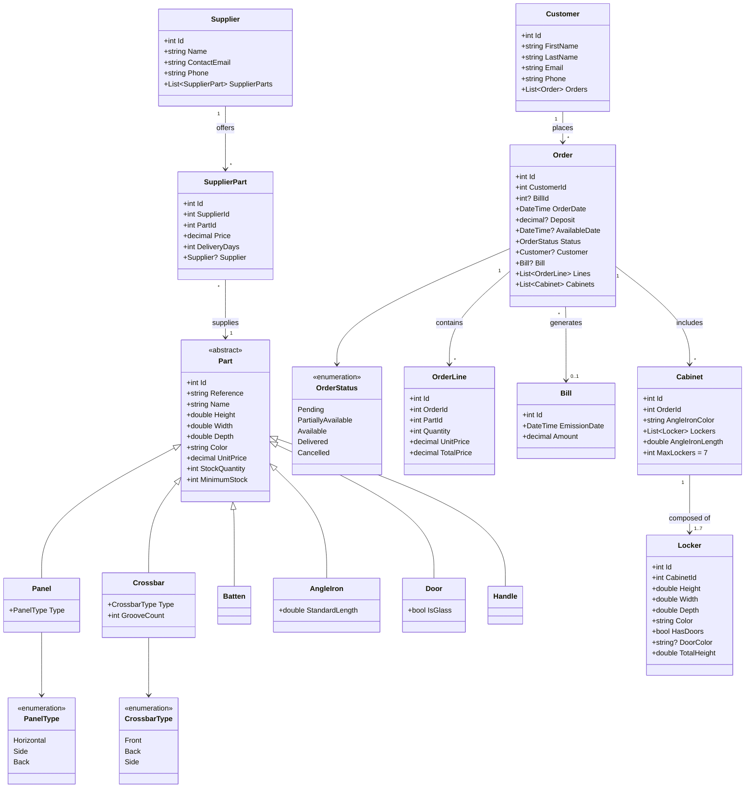
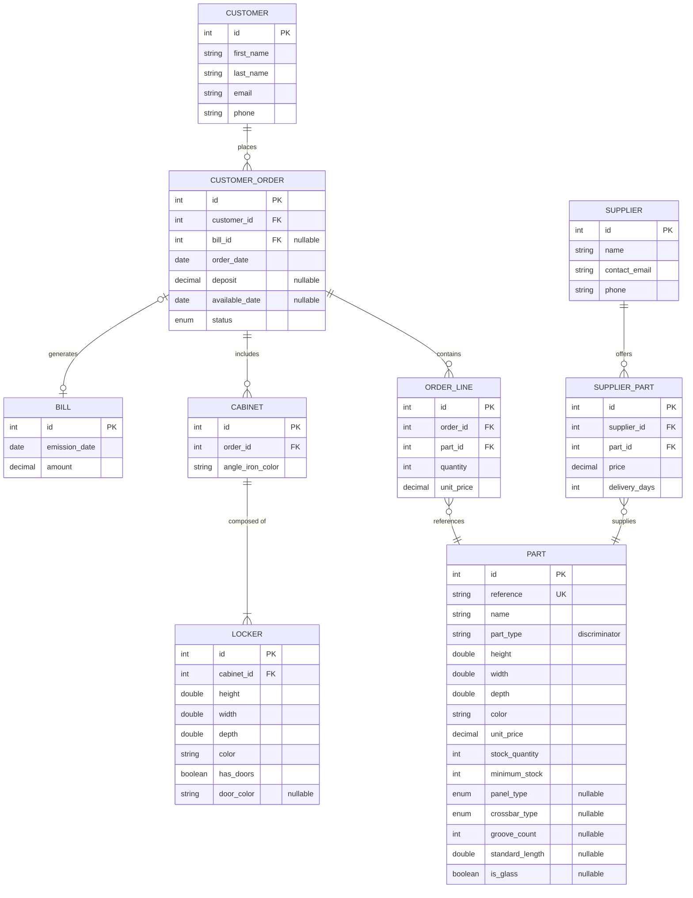

# KitBox - Database Design Documentation

This document presents the class diagram, entity-relationship diagram, and relational schema for the KitBox project.

---

## 1. Class Diagram (UML)



---

## 2. Entity-Relationship Diagram (ERD)



---

## 3. Relational Schema

### Tables

```
CUSTOMER (
    id              INT             PRIMARY KEY AUTO_INCREMENT,
    first_name      VARCHAR(100)    NOT NULL,
    last_name       VARCHAR(100)    NOT NULL,
    email           VARCHAR(255)    NOT NULL UNIQUE,
    phone           VARCHAR(20)
)

BILL (
    id              INT             PRIMARY KEY AUTO_INCREMENT,
    emission_date   DATE            NOT NULL,
    amount          DECIMAL(10,2)   NOT NULL
)

CUSTOMER_ORDER (
    id              INT             PRIMARY KEY AUTO_INCREMENT,
    customer_id     INT             NOT NULL,
    bill_id         INT             NULL,
    order_date      DATE            NOT NULL,
    deposit         DECIMAL(10,2)   NULL,
    available_date  DATE            NULL,
    status          ENUM('Pending', 'PartiallyAvailable', 'Available', 'Delivered', 'Cancelled') 
                                    NOT NULL DEFAULT 'Pending',
    
    FOREIGN KEY (customer_id) REFERENCES CUSTOMER(id),
    FOREIGN KEY (bill_id) REFERENCES BILL(id)
)

CABINET (
    id                  INT             PRIMARY KEY AUTO_INCREMENT,
    order_id            INT             NOT NULL,
    angle_iron_color    VARCHAR(50)     NOT NULL,
    
    FOREIGN KEY (order_id) REFERENCES CUSTOMER_ORDER(id) ON DELETE CASCADE
)

LOCKER (
    id              INT             PRIMARY KEY AUTO_INCREMENT,
    cabinet_id      INT             NOT NULL,
    height          DOUBLE          NOT NULL,
    width           DOUBLE          NOT NULL,
    depth           DOUBLE          NOT NULL,
    color           VARCHAR(50)     NOT NULL,
    has_doors       BOOLEAN         NOT NULL DEFAULT FALSE,
    door_color      VARCHAR(50)     NULL,
    
    FOREIGN KEY (cabinet_id) REFERENCES CABINET(id) ON DELETE CASCADE
)

PART (
    id              INT             PRIMARY KEY AUTO_INCREMENT,
    reference       VARCHAR(50)     NOT NULL UNIQUE,
    name            VARCHAR(255)    NOT NULL,
    part_type       ENUM('Panel', 'Crossbar', 'Batten', 'AngleIron', 'Door', 'Handle') 
                                    NOT NULL,
    height          DOUBLE          NOT NULL,
    width           DOUBLE          NOT NULL,
    depth           DOUBLE          NOT NULL,
    color           VARCHAR(50)     NOT NULL,
    unit_price      DECIMAL(10,2)   NOT NULL,
    stock_quantity  INT             NOT NULL DEFAULT 0,
    minimum_stock   INT             NOT NULL DEFAULT 0,
    
    -- Panel-specific
    panel_type      ENUM('Horizontal', 'Side', 'Back') NULL,
    
    -- Crossbar-specific
    crossbar_type   ENUM('Front', 'Back', 'Side') NULL,
    groove_count    INT             NULL,
    
    -- AngleIron-specific
    standard_length DOUBLE          NULL,
    
    -- Door-specific
    is_glass        BOOLEAN         NULL
)

ORDER_LINE (
    id              INT             PRIMARY KEY AUTO_INCREMENT,
    order_id        INT             NOT NULL,
    part_id         INT             NOT NULL,
    quantity        INT             NOT NULL,
    unit_price      DECIMAL(10,2)   NOT NULL,
    
    FOREIGN KEY (order_id) REFERENCES CUSTOMER_ORDER(id) ON DELETE CASCADE,
    FOREIGN KEY (part_id) REFERENCES PART(id)
)

SUPPLIER (
    id              INT             PRIMARY KEY AUTO_INCREMENT,
    name            VARCHAR(255)    NOT NULL,
    contact_email   VARCHAR(255)    NOT NULL,
    phone           VARCHAR(20)
)

SUPPLIER_PART (
    id              INT             PRIMARY KEY AUTO_INCREMENT,
    supplier_id     INT             NOT NULL,
    part_id         INT             NOT NULL,
    price           DECIMAL(10,2)   NOT NULL,
    delivery_days   INT             NOT NULL,
    
    FOREIGN KEY (supplier_id) REFERENCES SUPPLIER(id) ON DELETE CASCADE,
    FOREIGN KEY (part_id) REFERENCES PART(id) ON DELETE CASCADE,
    UNIQUE (supplier_id, part_id)
)
```

---

## 4. Key Design Decisions

### 4.1 Part Inheritance Strategy: Single Table Inheritance (STI)

The `PART` table uses a **discriminator column** (`part_type`) to store all part types in one table with nullable columns for type-specific attributes. This simplifies queries and foreign key relationships.

**Alternatives considered:**
- **Table-per-Type (TPT)**: Separate tables for each part type with FK to base PART table
- **Table-per-Concrete-Type (TPC)**: Completely separate tables, no inheritance at DB level

STI was chosen for:
- Simpler queries (no JOINs for basic part data)
- Single FK target for ORDER_LINE and SUPPLIER_PART
- Good performance for the expected data volume

### 4.2 Calculated Fields

These fields are **computed in code**, not stored in DB:
- `Locker.TotalHeight` = Height + 4 cm (2 crossbars × 2 cm each)
- `Cabinet.AngleIronLength` = Sum of all locker TotalHeights
- `OrderLine.TotalPrice` = Quantity × UnitPrice

### 4.3 Supplier Selection Logic

The business rule for supplier selection:
```
1. Find all SupplierPart records for the needed Part
2. Sort by Price ASC, then DeliveryDays ASC
3. Select the first supplier
```

### 4.4 Stock Management

- `stock_quantity`: Current available quantity
- `minimum_stock`: Threshold calculated from sales history
- When `stock_quantity < minimum_stock` → trigger reorder alert

---

## 5. Indexes Recommendations

```sql
-- Performance indexes
CREATE INDEX idx_order_customer ON CUSTOMER_ORDER(customer_id);
CREATE INDEX idx_order_status ON CUSTOMER_ORDER(status);
CREATE INDEX idx_cabinet_order ON CABINET(order_id);
CREATE INDEX idx_locker_cabinet ON LOCKER(cabinet_id);
CREATE INDEX idx_orderline_order ON ORDER_LINE(order_id);
CREATE INDEX idx_orderline_part ON ORDER_LINE(part_id);
CREATE INDEX idx_part_type ON PART(part_type);
CREATE INDEX idx_part_stock ON PART(stock_quantity, minimum_stock);
CREATE INDEX idx_supplierpart_supplier ON SUPPLIER_PART(supplier_id);
CREATE INDEX idx_supplierpart_part ON SUPPLIER_PART(part_id);
CREATE INDEX idx_supplierpart_price ON SUPPLIER_PART(price, delivery_days);
```

---

## 6. Entity Relationships Summary

| Relationship | Cardinality | Description |
|--------------|-------------|-------------|
| Customer → Order | 1:N | A customer can place many orders |
| Order → OrderLine | 1:N | An order contains multiple part lines |
| Order → Cabinet | 1:N | An order can include multiple cabinets |
| Order → Bill | 1:0..1 | An order may have one bill (after delivery) |
| Cabinet → Locker | 1:1..7 | A cabinet has 1 to 7 lockers |
| Part → OrderLine | 1:N | A part can appear in multiple order lines |
| Supplier → SupplierPart | 1:N | A supplier offers many parts |
| Part → SupplierPart | 1:N | A part can be supplied by many suppliers |
